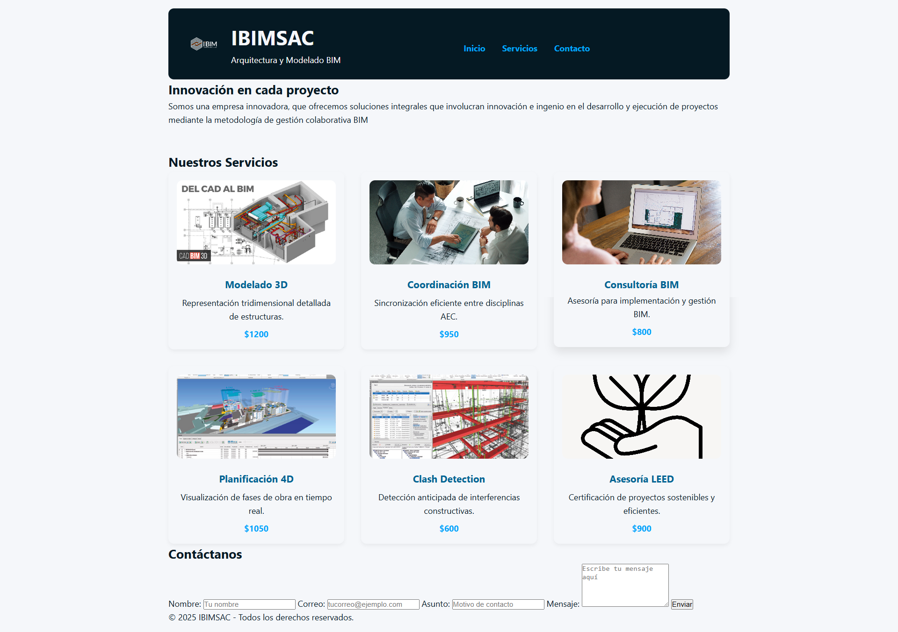

# IBIMSAC - Sitio Web Profesional

## Descripción
Este sitio web fue desarrollado como parte de la Tarea 11 del curso de Desarrollo Web. Presenta los servicios de la empresa de arquitectura y modelado BIM llamada IBIMSAC.

## Secciones
- Portada de presentación
- Catálogo de servicios con CSS Grid
- Formulario de contacto validado

## Tecnologías utilizadas
- HTML5 semántico
- CSS modular con BEM
- CSS Grid y Flexbox
- Animaciones con @keyframes
- Responsive Design

## Enlace del proyecto
👉 [Ver sitio en GitHub Pages](https://sebs1707.github.io/IBIMSAC-Arquitectura_y_modelado_BIM/)
